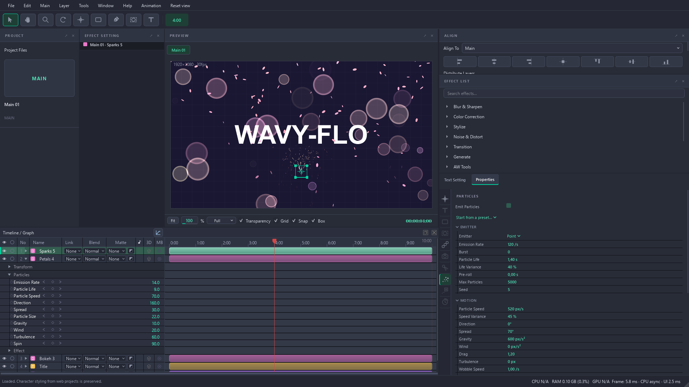
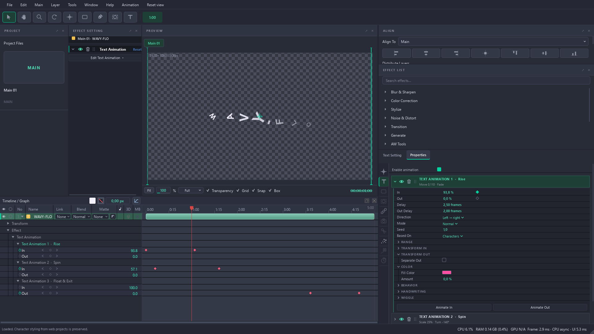
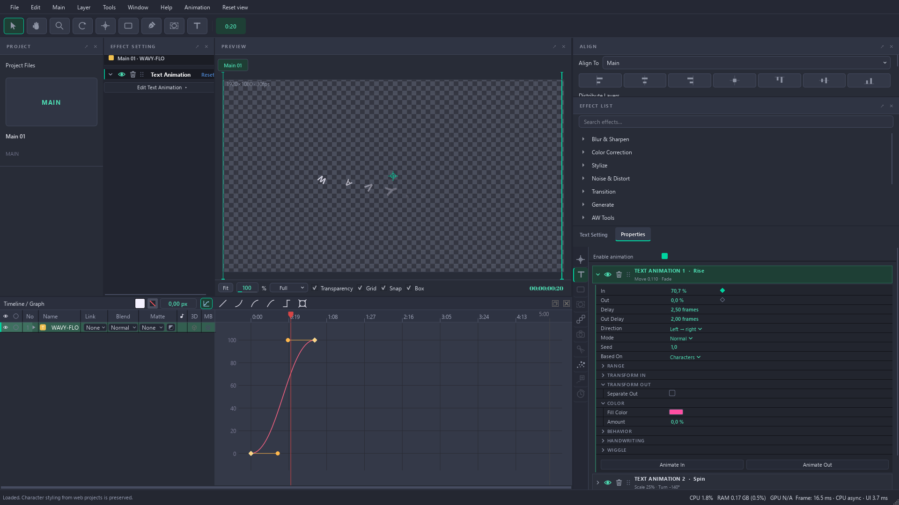
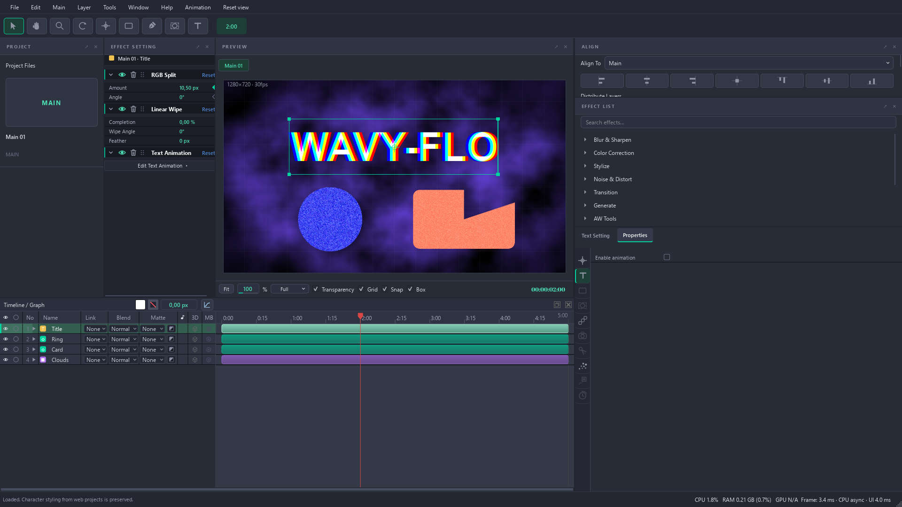
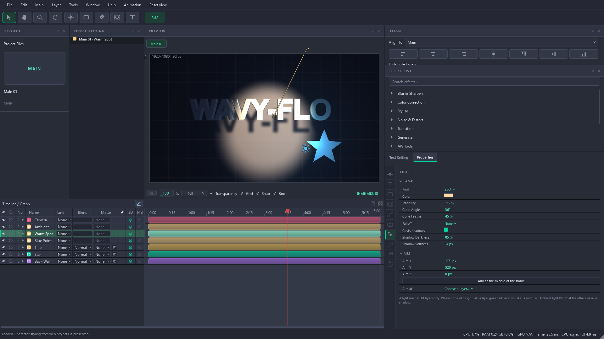
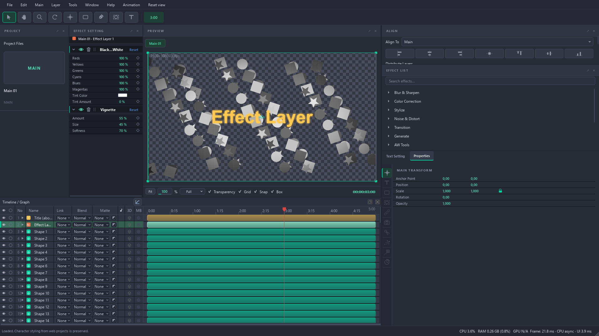
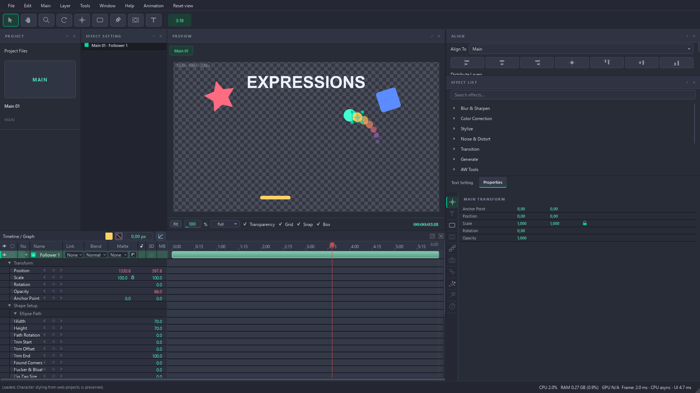
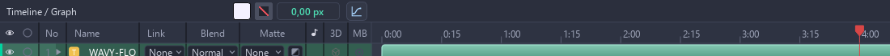
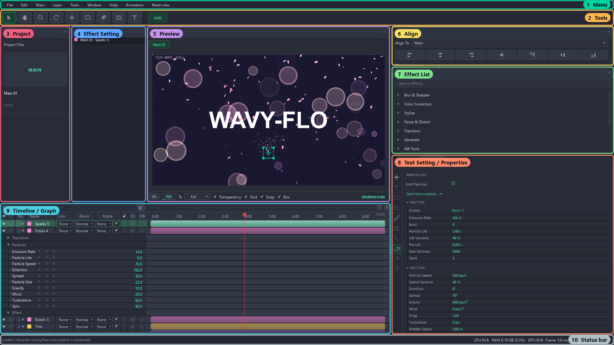

# Wavy-Flo

**Motion graphics and music videos, in real time, for Windows.**

Animated titles, particles, 3D lights, effects and keyframes, previewed as you work,
even on a computer without a strong graphics card.

-F06080)

### [⬇ Download the newest Wavy-Flo](https://github.com/Keblackan/Wavy-Flo-Releases/releases/latest)

---

## Contents
- [Download and install](#download-and-install)
- [Features](#features)
- [The workspace, part by part](#the-workspace-part-by-part)
- [Handy keys](#handy-keys)
- [Updates](#updates)

## Download and install
1. Get **Wavy-Flo-…-win64.zip** from [Releases](https://github.com/Keblackan/Wavy-Flo-Releases/releases/latest).
2. Unpack it anywhere, for example in Documents.
3. Open **Wavy-Flo.exe**. Nothing is installed and nothing is added to Windows.

Windows may say *"Windows protected your PC"* the first time: choose **More info → Run anyway**.

**Needs:** Windows 10 or 11, 64-bit. A graphics card helps but is not required: everything also renders on the processor, across all its cores.

---

## Features

### Text Animation
Letters, words or lines fly, spin, scale, fade, blur and change colour on their way in and out. You can stack several Text Animations on one text layer. Each one has its own **In** and **Out** strength, delay, order and range, and each can be switched off, reordered or removed from its heading. Presets give you a start in one click.

### Graph Editor
Shape any animation with curves. The graph opens on the keyframes you picked, including those of a second or third Text Animation. Drag the handles to ease in and out.
- **Shift** keeps a handle level.
- **Ctrl+click** on the curve adds a keyframe.
- **Ctrl+click** on an interior keyframe removes it.

### Effects
Blur & Sharpen, Color Correction, Stylize, Noise & Distort, Transition, Generate and more, all in the **Effect List**. Effects stack on a layer in the order you set, each with its own on/off eye, and every number can be keyframed. Effects are plug-in packs (`.wfx`), so new ones can be added without a new Wavy-Flo.

### 3D layers and lights
Turn any layer 3D, add a camera, and light the scene with spot, point and ambient lights that cast soft shadows.

### Effect Layer
One layer that grades or stylizes everything beneath it.

### Expressions
Link one property to another, or to time, with a short expression: a trail of followers, wiggles, loops.

### And also
- **Particles:** sparks, petals and bokeh with emitters, gravity, wind and turbulence (above, at the top of the page).
- **Shapes and masks:**
  - rectangles, ellipses, polygons and stars;
  - the Pen for your own paths;
  - feathered masks, boolean shape operations and shape modifiers.
- **Fill and Stroke on the timeline bar.** Change the colour and stroke of a Solid, Shape or Text layer without leaving the timeline.

  
- **Music videos:**
  - audio waveform and beat markers on the timeline;
  - Pulse on Beats;
  - Time Remap and Posterize Time.
- **Motion tracker:** follow a point in a video and pin a layer to it, or steady the shot.
- **Motion blur**, track mattes and blend modes.
- **Render Queue** in the background, plus a frame-accurate preview cache.
- **Export:** MP4, PNG sequence, and MOV through FFmpeg.

---

## The workspace, part by part

| # | Part | What it is for |
|---|------|----------------|
| 1 | **Menu** | File, Edit, Main, Layer, Tools, Window, Help and Animation. **Reset view** puts every panel back in its place. |
| 2 | **Tools** | Select (V), Hand, Zoom, Rotate, Anchor Point, Shape (right-click for rectangle, ellipse, polygon or star), Pen, Mask and Text. The green badge shows the current time. |
| 3 | **Project** | Your Mains (compositions) and the files you import. Double-click a file to put it into the open Main. |
| 4 | **Effect Setting** | The effects on the selected layer, in order: switch them on and off, reorder, reset or remove them, and change their numbers. |
| 5 | **Preview** | The picture as it will be rendered. Drag layers here to move them; Fit, zoom, quality (Full/Half/…), Transparency, Grid, Snap and Box sit underneath. |
| 6 | **Align** | Align layers to the frame or to each other, distribute them, and set the anchor point. |
| 7 | **Effect List** | Every effect, by category, with a search box. Double-click an effect to add it to the selected layer. |
| 8 | **Text Setting / Properties** | **Text Setting:** font, size, tracking, leading, fill and strokes. **Properties:** the selected layer's settings by tab: Main Transform, Text Animation, Shape, Mask, Repeater, Lens, Light, Particles, Tracker and Time. |
| 9 | **Timeline / Graph** | Layers in time. Each row has visibility, number, name, Link (parent), Blend, Matte, 3D and motion blur (MB). Open a layer to see its keyframes. The bar on top holds Fill, Stroke, stroke width and the Graph Editor button. |
| 10 | **Status bar** | Messages, plus what the computer is doing: CPU, RAM, GPU and how long each frame takes to draw. |

Every panel can be dragged by its title, floated, or closed. **Window** brings a closed one back.

---

## Handy keys
| Key | Does |
|-----|------|
| **V** | Select tool |
| **T** | Text tool |
| **U** | Show only the properties that have keyframes |
| **F9** | Easy Ease on the picked keyframes |
| **Ctrl+Z / Ctrl+Shift+Z** | Undo / Redo |
| **Shift** while dragging keyframes | Keep to one direction; in the Graph Editor, keep a handle level |
| **Ctrl** while dragging in the Preview | Do not snap |

---

## Updates
Wavy-Flo looks for a newer version as it opens. Press **Update**: it downloads the new version, checks it arrived whole, closes, installs and opens again by itself. Unsaved work is asked about first. **Later** and **Skip This Version** leave everything as it is.

What changed in each version is on the [Releases](https://github.com/Keblackan/Wavy-Flo-Releases/releases) page.

This repository holds only the downloads. Wavy-Flo's source is not here.
